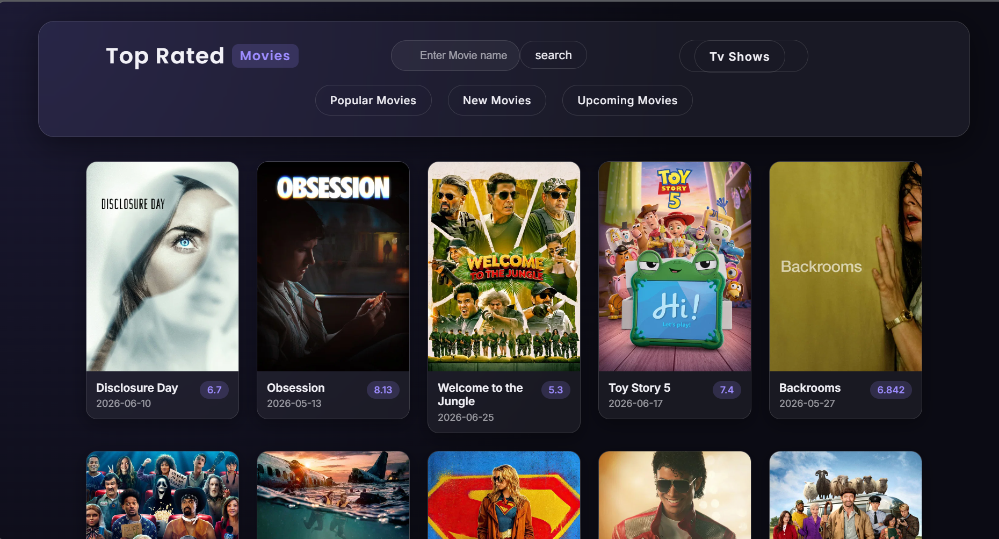
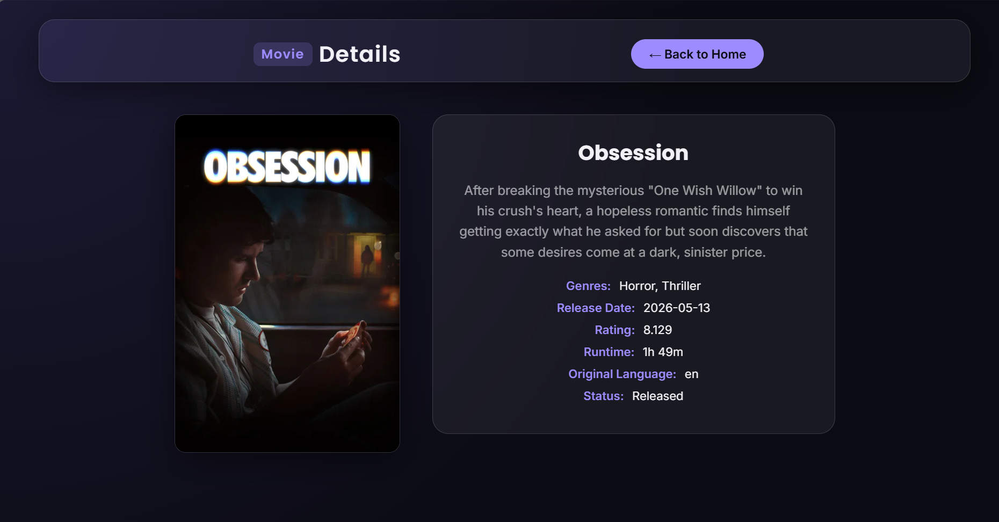

# 🎬 Movie Discovery Platform

A movie and TV show discovery platform built with vanilla HTML, CSS, and JavaScript. Browse popular, new, and upcoming titles, search for anything, and click into a full details page — all powered by the TMDB API.



## Features

- Browse **Popular**, **New**, and **Upcoming** movies
- Browse **TV Shows**
- Search for any movie by name
- Click any card to view full details — poster, overview, genres, release date, rating, runtime, original language, and status

## Screenshots

| Homepage | Movie Details |
|---|---|
|  |  |

## Tech Stack

- HTML5
- CSS3 (glassmorphism, responsive design)
- Vanilla JavaScript (Fetch API)
- [TMDB API](https://www.themoviedb.org/documentation/api)

## Project Structure

```
├── index.html          # Homepage — browse & search
├── movie.html          # Movie/TV details page
├── script.js           # Homepage logic (fetch, search, navigation)
├── movie.js            # Details page logic
├── style.css           # All styling
├── img/
│   └── screenshots/    # README screenshots
└── README.md
```

## Getting Started

1. Clone or download this repository
2. Open `index.html` with **Live Server** (VS Code extension) or any local server
3. Start browsing

## How It Works

- Clicking any movie or TV card sends its TMDB ID and media type to `movie.html?id=...&type=...`
- `movie.js` reads those URL parameters, calls the matching TMDB endpoint (`/movie/{id}` or `/tv/{id}`), and renders the details
- Missing fields (e.g. no runtime, no overview) automatically show as "Not Available"

## License

This project is for educational/portfolio purposes.